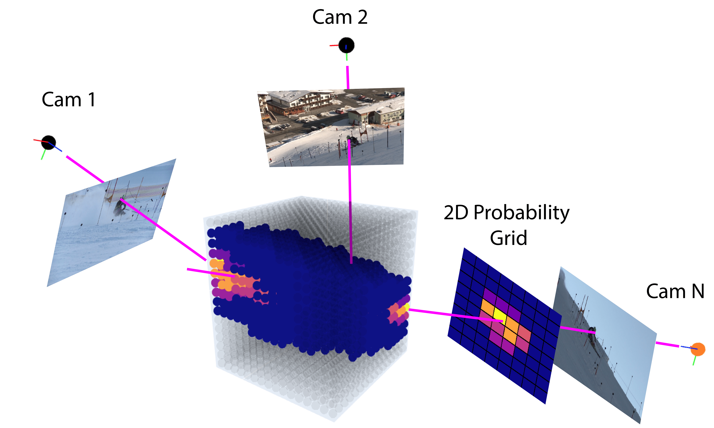

# Human Detection and Segmentation via Multi-view Consensus 
This is the source code for the ICCV 2021 paper "Human Detection and Segmentation via Multi-view Consensus".
<p align="center">

</p>

## Dependencies
<li> Python 3.6
<li> PyTorch 1.5
<li> Cuda 9.2
	
## Dataset
Please contact the authors (isinsu.katircioglu@gmail.com, joerg.spoerri@balgrist.ch) to have access to the Ski-PTZ dataset.
  
## Training
  - Download the Ski-PTZ dataset. The dataset should include subfolders named Videos_small, Videos, Data and Segmentation_masks.
  - Change the dataset path in dataset/dataset_factory.py. 
  - Download the [pre-trained models](https://drive.google.com/drive/folders/1oeY6SQwMwXiQJReDv-5dTyZcp_WBPofj?usp=sharing).
  - Create a folder named pretrained in the cloned directory and put the pre-trained models inside.
  
  You can start training with the following command:
```
$ cd src
$ python configs/run_config.py configs/config_dict_mvc_ski.py
```
 ## Citation
  Please cite the paper in your publications if it helps your research:
  ```
@inproceedings{Katircioglu21,
	Author = {I. Katircioglu and H. Rhodin and J. Sp{\"o}rri and M. Salzmann and P. Fua},
	Booktitle = ICCV,
	Title = {{Human Detection and Segmentation via Multi-view Consensus}},
	Year = 2021}
```
